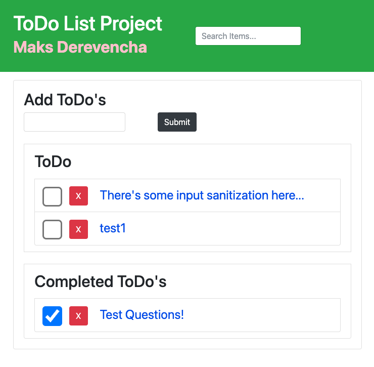

# ToDo-Web App w/ Flask and Javascript 

## Used this on a daily bases to track items. 
 
# Instructions: 
- pip3 install -r requirements.txt
- export FLASK_APP=app.py
- export FLASK_ENV=development
- flask run -h 0.0.0.0 -p 8080

# Future Release's:
- Zero Interaction install/run via Git and CyberPanel. 
- Setup.py

# Screenshot of Interface. 

# Sample logs/bruteforce attempts/ SQLi/ Wordpress exploits, ettc. 

